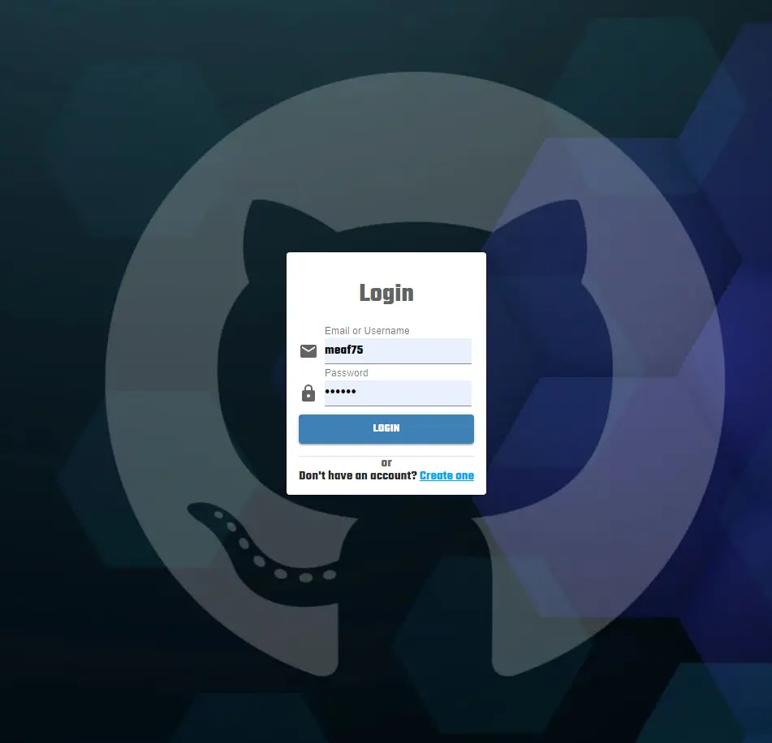

# Getting Started with React App
In this client app you can cosume the Rest API server located in this reposity, register an user and access to the rest of the application via auth and display a github profile repositories and liked repositories.

## Fist steps
- Create a ".evn" file in the client directory, you can use [.env.example](./.env.example) as reference

- Create a Github Personal access token to allow the app use the github graphql api, you can create it at https://github.com/settings/tokens and set the acess key into a react environment variable named "REACT_APP_GITHUB_ACCESS_KEY" (also can be setted in the .env file)

## Technologies
- material-ui
- React
- Axios
- GSAP
- react-router-dom
- Redux
- Typescript 💘
- styled-components
- Apollo + Graphql

## Available Scripts

In the project directory, you can run:

### `yarn start`

Runs the app in the development mode.\
Open [http://localhost:3000](http://localhost:3000) to view it in the browser.

The page will reload if you make edits.\
You will also see any lint errors in the console.

Demo

Login

Register

Home
